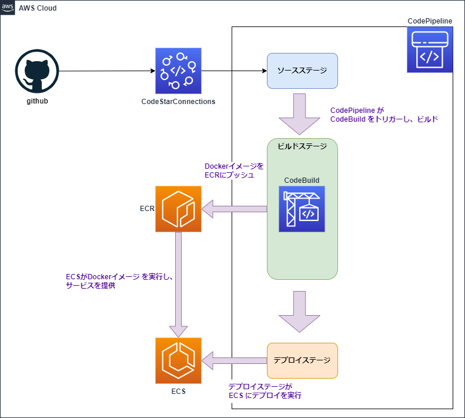

# GitHubのリポジトリとCodePipelineを連携させ、DockerイメージをCodeBuildを使ってビルドし、ECRにプッシュし、ECSにデプロイする


## コンソール画面での大まかな手順
1. **GitHubリポジトリの準備**: "https://github.com/shu130/aws_study29"
2. **Amazon ECRリポジトリの作成**
3. **CodeStar ConnectionでGitHubとAWSを連携**
4. **CodeBuildプロジェクトの作成**
5. **ECSでサービスをデプロイ**  
6. **CodePipelineを作成し、全体のCI/CDパイプラインを構築**

## 概要図




## 1. **GitHubリポジトリの準備**

- **Dockerfile**: Dockerイメージを作成
- **buildspec.yml**: CodeBuildがビルドプロセスを実行するための設定ファイル
- **index.html**: Dockerコンテナの中で使うサンプルの静的ファイル

### Dockerfile：

- **`nginx` の公式Dockerイメージ**を元にして、新しいコンテナを作成
- シンプルな **`index.html`** を `nginx` の公開ディレクトリにコピー
- コンテナ起動時に**`nginx` をフォアグラウンドで起動**し、Webサーバーを起動

```Dockerfile:Dockerfile
# Dockerfile
FROM nginx:alpine
COPY index.html /usr/share/nginx/html/index.html
CMD ["nginx", "-g", "daemon off;"]
```

### index.html

- 確認用のHTMLファイル

```html
<html lang='en'>
<head>
    <meta charset='UTF-8'>
    <meta name='viewport' content='width=device-width, initial-scale=1.0'>
    <title>Dockerテストページ</title>
</head>
<body>
    <h1>Hello, Docker!</h1>
    <p>このページが無事表示されていればOK！</p>
</body>
</html>
```

### buildspec.yml：

- **CodeBuild** で使う `buildspec.yml` の設定ファイル
- **DockerイメージをECRにビルド・プッシュ**し、ECSでデプロイするためのビルドプロセスを自動化

```yml:buildspec.yml
version: 0.2

env:
  variables:
    ECR_REPOSITORY: https://github.com/shu130/aws_study29

phases:
  pre_build:
    commands:
      - echo Logging in to Amazon ECR...
      - aws ecr get-login-password --region ap-northeast-1 | docker login --username AWS --password-stdin ${ECR_REPOSITORY}
  build:
    commands:
      - echo Building the Docker image...
      - docker build -t container-test-app .
      - docker tag container-test-app:latest ${ECR_REPOSITORY}:latest
  post_build:
    commands:
      - echo Pushing the Docker image...
      - docker push ${ECR_REPOSITORY}:latest
      - echo Build completed on `date`
      - echo Creating imagedefinitions.json...
      - |
        echo '[
          {
            "name": "container-test-app",
            "imageUri": "'${ECR_REPOSITORY}':latest"
          }
        ]' > imagedefinitions.json
      - echo imagedefinitions.json created.

artifacts:
  files:
    - imagedefinitions.json
```

####  `env: variables`:
  - ビルド環境で使う変数を定義
  - `ECR_REPOSITORY` という変数で ECR のリポジトリURLを指定
  - ECRリポジトリ作成後にURIを記載する

#### 1. `pre_build`: ビルド前の準備
このフェーズでは、ECRにログインするためのコマンドを実行する。

- **`aws ecr get-login-password --region ap-northeast-1 | docker login --username AWS --password-stdin ${ECR_REPOSITORY}`**:
  - AWS ECRにログインするためのコマンド  
  - まず、`aws ecr get-login-password` を使ってAWSからログイン用のパスワードを取得し、Dockerのログインコマンドに渡す
  - ECRに対してDockerを使って操作する準備が整う

#### 2. `build`: Dockerイメージのビルドとタグ付け
このフェーズでは、Dockerイメージをビルドし、ECRにプッシュするためのタグを付ける。

- **`docker build -t container-test-app .`**:
  - 現在のディレクトリ（`.`）にある `Dockerfile` を元に、`container-test-app` という名前のDockerイメージをビルド

- **`docker tag container-test-app:latest ${ECR_REPOSITORY}:latest`**:
  - ビルドしたDockerイメージに「タグ」を付ける
  - タグ付けは、ECRにイメージをプッシュする際に必要
  - `container-test-app:latest` はローカルでのイメージ名  
  - `${ECR_REPOSITORY}:latest` はECRにプッシュする際のイメージ名

#### 3. `post_build`: イメージのプッシュと後処理
ビルド後のフェーズ。ここでは、DockerイメージをECRにプッシュし、ECSデプロイ用のファイル（`imagedefinitions.json`）を作成する。

- **`docker push ${ECR_REPOSITORY}:latest`**:
  - ECRにDockerイメージをプッシュ
  - `latest` タグ付きのイメージがECRにアップロードされる

- **`echo '[
            {
              "name": "container-test-app",
              "imageUri": "'${ECR_REPOSITORY}':latest"
            }
          ]' > imagedefinitions.json`**:
  - ECSのデプロイに必要な `imagedefinitions.json` というファイルを作成
  - ECSが使用するDockerイメージの名前とECRのURLが含まれる

#### `artifacts`: 出力する成果物
ビルドの成果物（アーティファクト）として保存するファイルを指定する。

- **`files: - imagedefinitions.json`**:
  - ビルドの最後に `imagedefinitions.json` を保存し、次のステップでECSにデプロイする際に使用


---

### 2. **ECRリポジトリの作成**

ECRを使用してDockerイメージを保存する。

1. **ECRリポジトリの作成**:
   - 作成後に`URI`を`buildspec.yml`の変数に記載

---

### 3. **CodeStar ConnectionでGitHubとAWSを連携**

AWSとGitHubを接続するために、CodeStar Connectionsを使用する。

  **CodeStar Connectionの作成**:
   - コンソール画面の`CodePipeline`
   - デベロッパー用ツール＞接続＞接続を作成
   - GitHub App をインストールしてボットとして接続

---

### 4. **CodeBuildプロジェクトの作成**

GitHubリポジトリのコードからDockerイメージをビルドし、ECRにプッシュする。

   - **ソースプロバイダ**として「github」を選び、上記で作成した`CodeStar Connections`接続を選択
   - **アーティファクト**は特に指定しない  
     (リポジトリ内の `buildspec.yml` に、DockerイメージをビルドしECRにプッシュするためのステップが定義済み)
   - ECRのコンソール画面でプッシュされていることを確認

---

### 5. **ECSでサービスをデプロイ**

ビルドされたDockerイメージをデプロイするためのECSクラスターを準備する。

   - **Fargate** でクラスターを作成
   - タスク定義作成：コンテナにはECRにプッシュされたDockerイメージのURLを指定
   - サービス作成：必要なVPC,サブネット,セキュリティグループを指定して、ECS上でコンテナを実行
   - `index.html`の内容が表示されることを確認

---

### 6. **CodePipelineを作成**

GitHubでコードがプッシュされた時にビルド・デプロイまでの自動化を行う。

   - **パイプライン名**を指定
   - **ソースプロバイダ**として「github v2」を選び、上記で作成した`CodeStar Connections`接続を選択
   - **ビルドステージ**で「CodeBuild」を選択し、上記で作成したCodeBuildプロジェクト名を指定
   - **デプロイステージ**で「Amazon ECS」を選び、ターゲットとなるECSクラスターとサービスを指定、イメージ定義ファイルに`imagedefinitions.json`を指定


### 確認

- githubにある`index.html`を直接編集
- pipelineが発動し、編集した内容でWebブラウザに表示されることを確認
